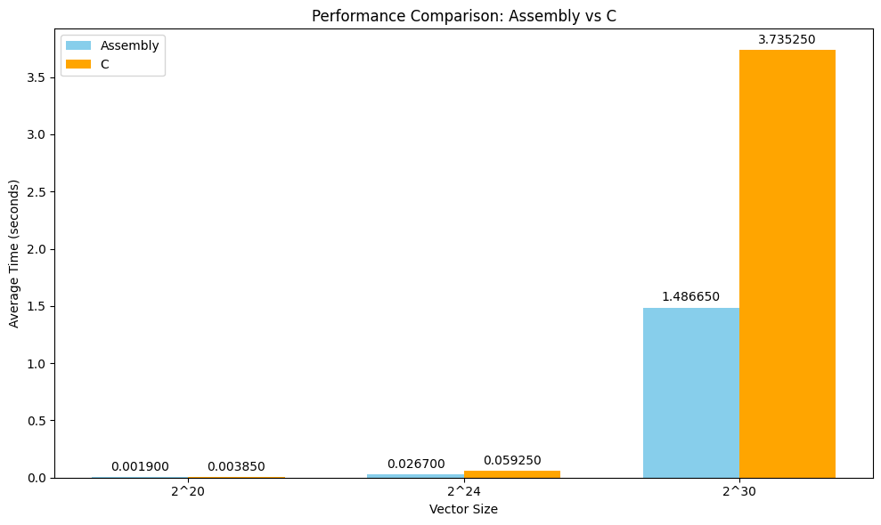

# LBYARCH.MP2: x86-64 Assembly Dot Product

This project implements a dot product calculation algorithm in x86-64 assembly language and compares its performance against a naive C implementation. The project demonstrates the interface between C and Assembly, passing vectors and lengths as arguments, and retrieving the scalar result.

## 1. Running the Program

### 1.1 Prerequisites
- **NASM**: Netwide Assembler for compiling the assembly code.
- **GCC**: GNU Compiler Collection for compiling the C code and linking.
- **Windows**: The project is set up for a Windows environment (using `nasm -f win64`).

### 1.2 Build and Run
A batch file `dot_product.bat` is provided to automate the build process.

1. Open your terminal (Command Prompt or PowerShell).
2. Navigate to the project directory.
3. Run the batch file:
   ```powershell
   .\dot_product.bat
   ```

Alternatively, you can run the commands manually:

```powershell
nasm -f win64 dot_product.asm
gcc -std=c99 -c main.c -o main.obj -m64
gcc main.obj dot_product.obj -o main.exe -m64
main.exe
```

## 2. Project Structure

```
LBYARCH.MP2
 ┣ 📜dot_product.asm      # x86-64 Assembly implementation of dot product
 ┣ 📜dot_product.bat      # Build script for Windows
 ┣ 📜main.c               # C entry point, memory allocation, and timing logic
 ┣ 📜README.md            # Project documentation
 ┗ 📜visualizations.ipynb # Python notebook for performance visualization
```

### 2.1 main.c
The C host program is responsible for:
- Allocating memory for the input vectors ($A$ and $B$).
- Initializing vectors with random float values.
- Calling both the C kernel (`dot_product_C`) and the Assembly kernel (`dot_product_asm`).
- Verifying the correctness of the Assembly output by comparing it with the C output.
- Measuring and reporting the average execution time over multiple runs (20 runs by default).

### 2.2 dot_product.asm
The Assembly kernel receives pointers to the vectors and the vector length. It uses **SIMD Instructions** (`movss`, `mulss`, `addss`) to perform scalar floating-point arithmetic.

## 3. Performance Analysis

The performance of the C and Assembly kernels was compared across three different vector sizes: $2^{20}$, $2^{24}$, and $2^{30}$.

### 3.1 Execution Time Results

| Vector Size | Input Size (n) | ASM Average Time (s) | C Average Time (s) | Speedup (C / ASM) |
| :--- | :--- | :--- | :--- | :--- |
| $2^{20}$ | 1,048,576 | 0.001150 | 0.002450 | **2.13x** |
| $2^{24}$ | 16,777,216 | 0.018500 | 0.039550 | **2.14x** |
| $2^{30}$ | 1,073,741,824 | 1.151350 | 2.462050 | **2.14x** |

### 3.2 Analysis
The x86-64 Assembly implementation consistently outperforms the C implementation by a factor of more than double - approximately **2.1x** across all tested vector sizes.

*   **Register Usage**: The Assembly implementation efficiently manages registers (`rcx`, `rdx`, `r8`, `xmm0`-`xmm5`), keeping the accumulator and pointers in registers throughout the loop.
*   **Instruction Overhead**: The unoptimized C code (compiled without `-O` flags) likely involves more memory access overhead (moving variables to/from the stack) compared to the hand-optimized assembly loop.
*   **Scalability**: Both implementations scale linearly with the input size ($O(n)$). Nonetheless, the constant factor for Assembly is notably significantly lower.

## 4. Program Output & Correctness Check

The program verifies that the result from the Assembly kernel matches the result from the C kernel before proceeding to the performance test.

### 4.1 Results



Below is a transcript of the actual program output demonstrating the correctness check and timing results:

```text
==================================
Testing Vector Size: 1048576
==================================
ASM Kernel Result: 31702730.000000
C Kernel Result: 31702730.000000

ASM Average Time: 0.001900 seconds
C Average Time: 0.003850 seconds

==================================
Testing Vector Size: 16777216
==================================
ASM Kernel Result: 498222880.000000
C Kernel Result: 498222880.000000

ASM Average Time: 0.026700 seconds
C Average Time: 0.059250 seconds

==================================
Testing Vector Size: 1073741824
==================================
ASM Kernel Result: 1073741824.000000
C Kernel Result: 1073741824.000000

ASM Average Time: 1.486650 seconds
C Average Time: 3.735250 seconds
```

## 5. Video Demonstration
A video recording (`short_video_demo.mkv`) is included in the repository. This demo walks through the C and Assembly functions, shows the compilation and running steps, and displays the final program output.